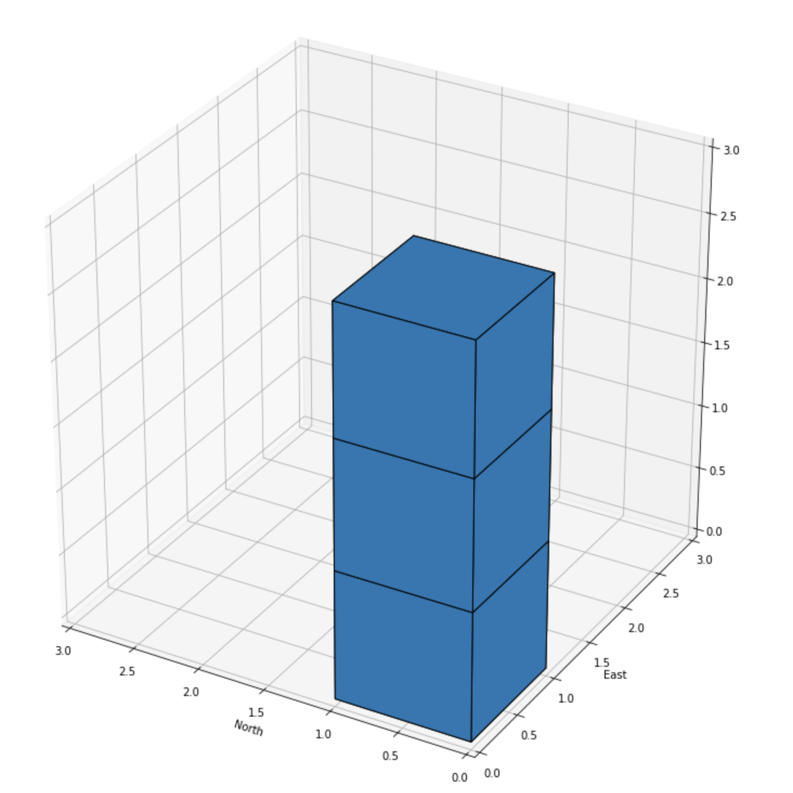
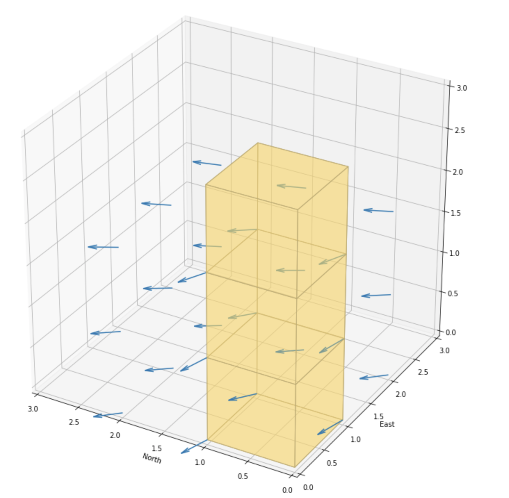
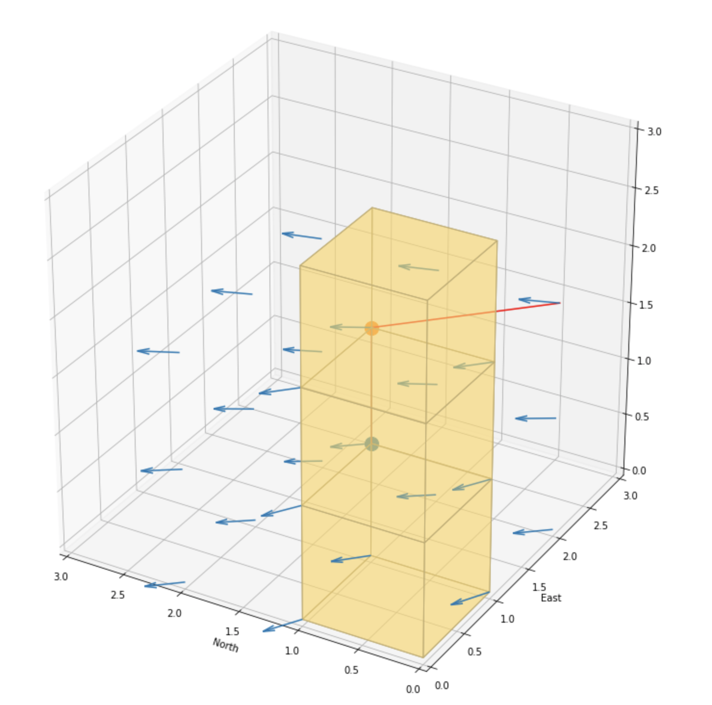

# Flying Car Motion-Planning Assignment
Date: Sept 2018

I have prepared two versions as explained below: 

#### A) motion_planning.py: 

motion_planning.py contains the code required to pass this assignment. In addition to minimum requirements, I have also added the following changes: 


1. I realised that running A* on the entire collider data grid to find a path takes a very long time, if the destination is far away. Therefore, I implemented the Median Axis algorythm (with Skeleton) and run the A* on the skeleton data instead of the entire grid. That did significantly reduce the time create the path and the waypoints. 

2. In the local_position_callback(), i increased the minimum distanse to each waypoint, to trigger waypoint_transision towards the nest waypoint. I increased it from 1.0 to 6.0. that has made the drone transision between waypoints much smoother and it looks better.   

3. Just because of curiosity, I did also try to use graphs to create random waypoints and select a path through them. The code seems like working but of some reason, it was extreemly slow on my computer. Therefore, I moved that code to a folder that is called "Probalistic Waypoints__DIDNT WORK". Please feel free to have a look if you are interested. 


#### A) motion_planning_rh.py:

In addition to above, I did spend another 10 - 15 additional hours trying to implement a Reciding Horizon 3D grid around the drone and find an intermediate path through it. It is still not functioning perfectly and I think I do need to spend another 10h to figure out how to improve it. However, as it is not the main requirement of this assigment, I left it as it is for the moment. You can try it out by running motion_plannin_rh.py

And there are the staps I took to create it: 

1. I created a 3D grid around the posision of the drone that looks like the following: 



2. I used a slightly modified version of the potential_field code to create vector based costs for each grid cell. 



3. I did really not know what to use to calculate the intermediate path of the drone within the 3D grid, so I modified the A* algorythm to find a path within the 3D grid using the vector costs that I calculated using the potential_field code. picture below shows the path. (please note that vectors are pointing to the opositie direciton)




## Task 1: Explain the starter code

I run motion_planning.y and backyard_flyer_solution.py side by side and found the following differences: 

1. States(Enum) have an additional value called PLANNING. Also the assignment of the values have changed to auto() instead of manual assignement 
2. PackyardFlyer class name has changed to MotionPlanning
3. state_callback() function has an additional PLANNING step after ARMING. Plan_path() is called torun the palnning and to find and prepare the waypoints that the drone should follow. 
There is no calculate_box() anymore becouse this time we will be following the waypoints that were created during the planning phase instead of flying within a box. 
4. arming_transition() doesnt set the hme position anymore becouse this time we will be landing at a destination location.
5. There is another new function called send_waypoints, that is used to send the newly planned waypoint data to the simulator. This is for the simulator to be able to visualise the path. 
6. plan_path() funciton is incomplete and needs the planning code that is part of this assigment. 


#### To summarise, the code does the following: 

1. Connects tot he simulator using MavlinkConnect()
2. Initiates some parameters and registers 3 callback functions that will be called by the flight controller based on the state of the flight. 
3. the state_callback funciotn initiates ARMING, and PLANNING phases. 
4. Plan_path() funciton, loads the 2.5D obstacle list (colliders.csv). it converts it to usable data, calculates the planning path and creates the waypoints that the drovne will follow. 
5. positioning events call the local_position_callback() funciton periodically and it will detect when the drone reaches  intermediate drone destinations until the last waypoint. After reaching the last waypoint, it will initiate the landing.


## Task 2: Implementing Your Path Planning Algorithm

#### 2a) Modify your code to read the global home location from the first line of the colliders.csv file and set that position as global home (self.set_home_position())

1. Added a new function called read_home_location() in the planning_utils.py file
2. Added the following code to plan_path():

```python
        # TODO: read lat0, lon0 from colliders into floating point values
        lat0, lon0 = read_home_location()

        # TODO: set home position to (lon0, lat0, 0)
        self.set_home_position(lon0, lat0, 0)

        # TODO: retrieve current global position
        current_global_position = self.global_position

        # TODO: convert to current local position using global_to_local()
        current_local_position = global_to_local(current_global_position, self.global_home)
```        

#### 2b) Retrieve your current position in geodetic coordinates from self._latitude, self._longitude and self._altitude. Then use the utility function global_to_local() to convert to local position (using self.global_home as well, which you just set)

Added the following: 

```python
        # TODO: retrieve current global position
        current_global_position = [self._longitude, self._latitude, self._altitude]
        print("self.global_position: {0}".format(self.global_position))
        print("current_global_position: {0}".format(current_global_position))

        # TODO: convert to current local position using global_to_local()
        current_local_position = global_to_local(current_global_position, self.global_home)
        print("current_local_position: {0}".format(current_local_position))
```        

#### 2c) In the starter code, the start point for planning is hardcoded as map center. Change this to be your current local position.

Added the following: 

```python
        #grid_start = (-north_offset, -east_offset)

        # TODO: convert start position to current position rather than map center
        grid_start = ( int(np.ceil(current_local_pos[0]-north_offset)), int(np.ceil(current_local_pos[1]-east_offset) )
```     

#### 2d) In the starter code, the goal position is hardcoded as some location 10 m north and 10 m east of map center. Modify this to be set as some arbitrary position on the grid given any geodetic coordinates (latitude, longitude)

Added the following code to:
1. goal_global_position = is a global latitude, longitude position. 
2. First, I made a funciton that added some distance to the home_location to use it as the goal but then I realised its easier to fly the drone manually to some other location and type in the locations in the code manuall. Anyway, if needed, the following line is still there and can be used if necessary.

```python
      #goal_global_position = new_global_position(self.global_home, 15, 25) #adding 20 x 10 meters to the global_home position.   
```

2. Below is what I added to calculate the goal position. (Please ntoe that later on I also added a skeleton calculation and had to calculate the goal on the skeleton. 


```python
        goal_global_position = [-122.401055, 37.795461, 0]
        goal_local_position = global_to_local(goal_global_position, self.global_home)
        grid_goal = (int(goal_local_position[0] - north_offset), int(goal_local_position[1] - east_offset))

        print("goal_local_position: {0}".format(goal_local_position))
        print("grid_goal: {0}".format(grid_goal))
        print("grid.shape: {0}".format(grid.shape))

        if grid_goal[0] > grid.shape[0] or grid_goal[1] > grid.shape[1] or grid_goal[0] < 0 or grid_goal[1] < 0:
            print("\n * NOTE: Destination is outside the grid map. setting it back to start ")
            grid_goal = grid_start
            self.landing_transition()
```   


#### 2e) add diagonal motions to the A* implementation provided, and assign them a cost of sqrt(2). However, you're encouraged to get creative and try other methods from the lessons and beyond!

Added diagonal motions by adding new possible actions to the Action(Enum) as shown below. The costs for diagonal actions are math.sqrt(2)

```python
#Diagonal Movements
    NE = (-1, 1,math.sqrt(2))
    SE = ( 1, 1,math.sqrt(2))
    SW = ( 1,-1,math.sqrt(2))
    NW = (-1,-1,math.sqrt(2))
``` 

I also added the following lines in valid_actions. This is to test if any of diagonal actions will result collision with obstacles and if it does, remove them from possible actions. 

```python
# Diagonal movements
    if x - 1 < 0 or y - 1 < 0 or grid[x-1,y-1] == 1:
        valid_actions.remove(Action.NW)
    if x - 1 < 0 or y + 1 > m or grid[x-1,y+1] == 1:
        valid_actions.remove(Action.NE)
    if x + 1 > n or y - 1 < 0 or grid[x+1,y-1] == 1:
        valid_actions.remove(Action.SW)
    if x + 1 > n or y + 1 > m or grid[x+1,y+1] == 1:
        valid_actions.remove(Action.SE)
```        


#### 2f) Cull waypoints from the path you determine using search.


Added a collinearity check and prune_path funciton to prune some of the zick-zack going waypoints. 

I prepared both the np.linalg.det() that supports floating funciton and the option that supports only int values. I guess, becouse of the CPU cost of floating point calculation, I should try to use the int option for now. 

As there were many waypoints within 2-3 meeters zickzacking on a straight path, I'm using a big epsilon (epsilon=2.5) trying to reduce the number of waypoints. 

```python
def point(p):
    return np.array([p[0], p[1], 1.])

def collinearity_check(p1, p2, p3, epsilon=2.5): 
    mat = np.vstack((point(p1), point(p2), point(p3)))
    det = np.linalg.det(mat)
    return np.abs(det) < epsilon

def collinearity_check_int(p1, p2, p3): 
    collinear = False
    det = p1[0]*(p2[1] - p3[1]) + p2[0]*(p3[1] - p1[1]) + p3[0]*(p1[1] - p2[1])
    if det == 0:
        collinear = True
    return collinear

def prune_path(path):
    path = [p for p in path]
    i = 0
    while i < len(path) - 2:
        #if collinearity_check(path[i], path[i+1], path[i+2]):
        if collinearity_check_int(path[i], path[i+1], path[i+2]):
            path.remove(path[i+1])
        else:
            i += 1
    return path
```       


## Task 3: Executing the flight

After starting the testing, I made the following adjustments: 


